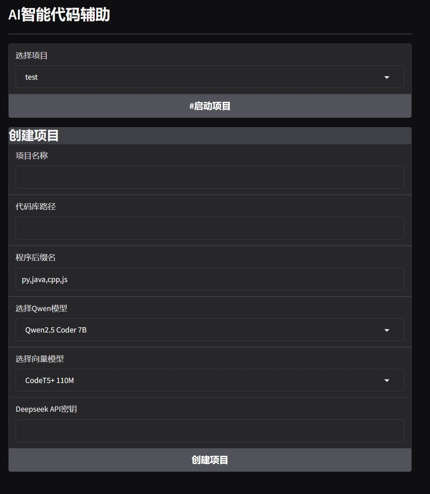
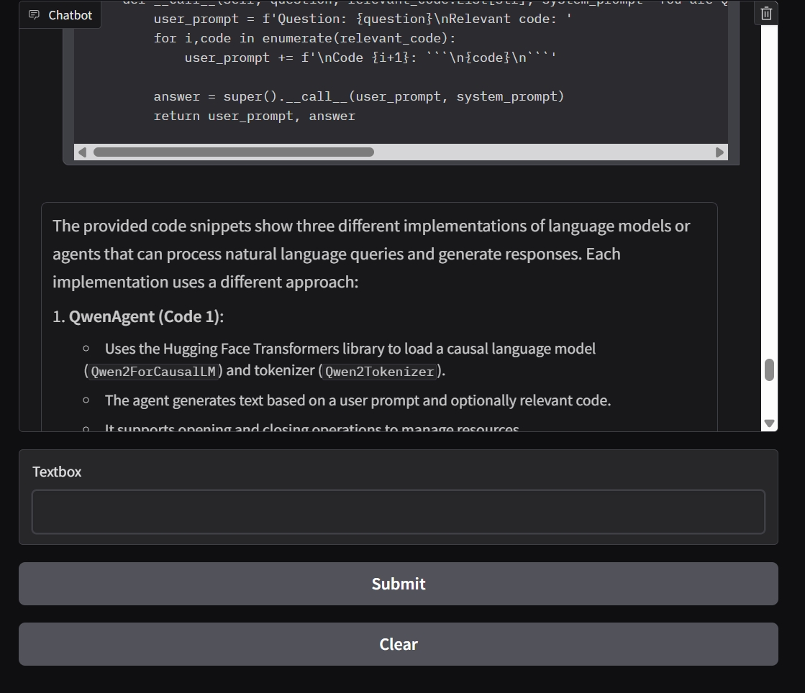
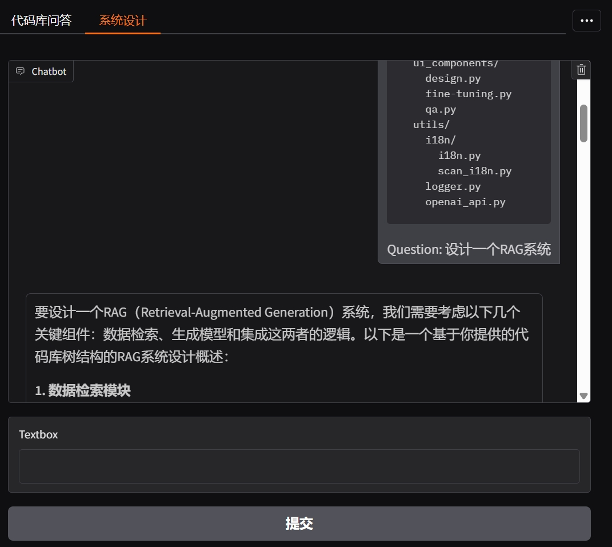
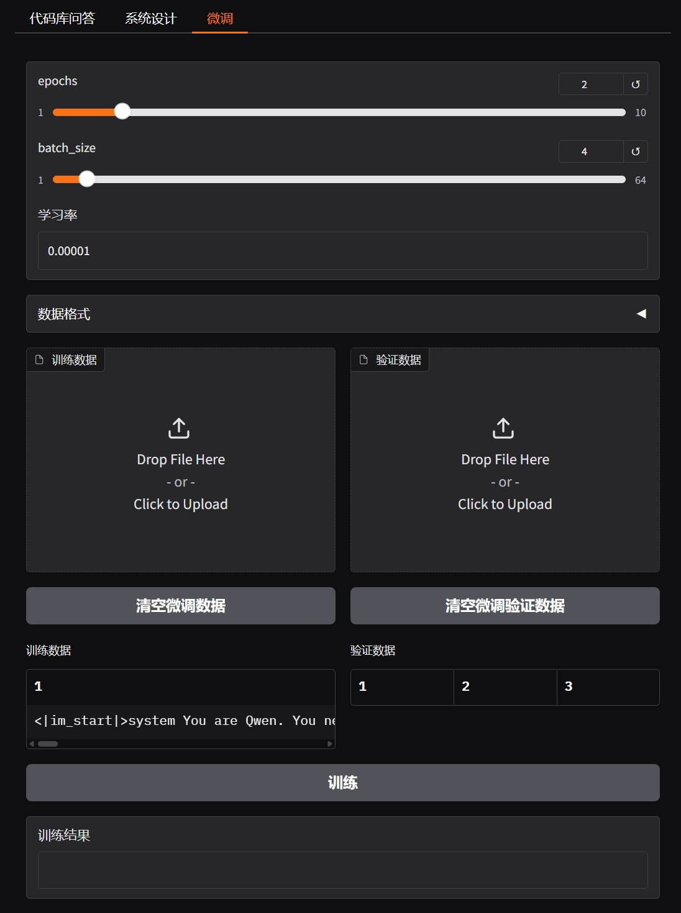

# AI智能代码辅助

<!-- [en](./docs/README_en.md) -->

## 功能特性 🎯

- [x] 支持**分布式Views**架构，每个网页可以单独加载和单元测试 
- [x] 完整的 **Agentic架构**，代码 **结构清晰**，易于维护
- [x] `agents\`目录下，将LLM包装成agents,具有高可扩展性，未来可以训练agents。
- [x] 支持 **双语**"：`python main.py zh_CN` 和 `python main.py en_US`
- [x] 支持 **RAG检索**"：将codebase每一个file储存为vectors，以便于RAG agent找到最高相关性的代码
- [x] 支持 **代码库QA**
- [x] 支持 **代码库系统设计** 
- [x] 支持 **微调** 
- [x] 支持 **Deepseek**、**通义千问**等多种模型接入


### 后期计划 📅

- [ ] 优化微调页面
- [ ] 优化RAG系统，支持精确查找
- [ ] 优化长文本输出和训练
- [ ] 优化前端界面

### 注意事项 ⚠️
- 根据现存大小选择合适的模型
- 按照设置要求配置环境
- 第一次下载模型耗费时间较多
- 注意网络环境是否支持下载Huggingface模型

## 设置
1. 创建conda虚拟环境
```bash
conda create -n deep_code python=3.12
conda activate deep_code
```

2. 根据GPU的CUDA版本或者CPU安装PyTorch.

示例：
```bash
pip install torch torchvision torchaudio --index-url https://download.pytorch.org/whl/cu128
```

3. 安装第三方库
```bash
pip install -r requirements.txt
```

## 成果展示

### 创建项目页面



### QA页面



### 系统设计页面



### 微调页面




## 相关论文

```
@article{qwen2.5,
    title   = {Qwen2.5 Technical Report}, 
    author  = {An Yang and Baosong Yang and Beichen Zhang and Binyuan Hui and Bo Zheng and Bowen Yu and Chengyuan Li and Dayiheng Liu and Fei Huang and Haoran Wei and Huan Lin and Jian Yang and Jianhong Tu and Jianwei Zhang and Jianxin Yang and Jiaxi Yang and Jingren Zhou and Junyang Lin and Kai Dang and Keming Lu and Keqin Bao and Kexin Yang and Le Yu and Mei Li and Mingfeng Xue and Pei Zhang and Qin Zhu and Rui Men and Runji Lin and Tianhao Li and Tingyu Xia and Xingzhang Ren and Xuancheng Ren and Yang Fan and Yang Su and Yichang Zhang and Yu Wan and Yuqiong Liu and Zeyu Cui and Zhenru Zhang and Zihan Qiu},
    journal = {arXiv preprint arXiv:2412.15115},
    year    = {2024}
}
```

```
@article{wang2023codet5plus,
  title={CodeT5+: Open Code Large Language Models for Code Understanding and Generation},
  author={Wang, Yue and Le, Hung and Gotmare, Akhilesh Deepak and Bui, Nghi D.Q. and Li, Junnan and Hoi, Steven C. H.},
  journal={arXiv preprint},
  year={2023}
}
```

